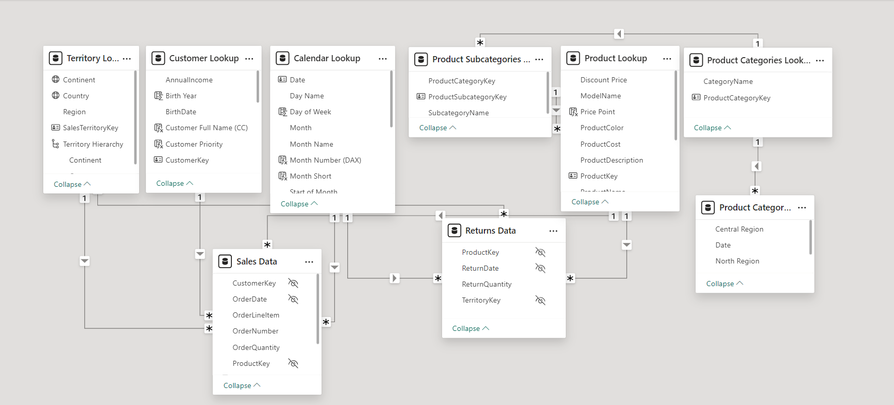
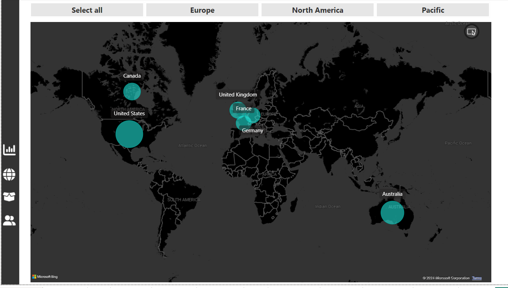

# Power-BI-Reports

## Project Title: Adventure Works

### Project Description

- In this project I had the opportunity to work with Adventure Works dataset. Adventure Works is a bike manufacturer and seller.
- The project involves creating a Power BI dashboard to analyze various aspects of the business, including sales, revenue, profit, customer behavior, product performance, and returns.
- The dashboard aims to provide actionable insights to support decision-making processes.

#### Loading Data

I imported raw data in form of .cvs format and loaded it directly in the PowerBI. A total of 8 files were imported, each occupying their own table.

#### Data Cleaning

After loading the data into Power BI, I performed the follwoing data cleaning steps:
- Removed duplicates
- Handled missing values
- Standardized data formats

#### Data Modelling

After loading and cleaning up the data, I created data models by establishing relationships among the tables. One-to-many relationships
  were very prevalent among the tables, such as:
  - **Customers to Sales**: One customer can have many sale transactions.
  - **Products to Sales**: One product can appear in many sales transactions.
  - **Sales to Returns**: One sales transaction can have multiple returns.
    
 Below is a screenshot of the model view.
  
  
  
### Key Visualizations

#### Executive Dashboard: 
- This is the major dashboard that houses the company's KPI's and metric that are crucial for decision-making. Executives can quickly assess the overall
  health of the company and identify areas that need attention or improvement.
- The dashboard dispalys visuals including charts and graphs for Trending Revenue, Orders among other top selling products.
  
  Below is a screenshot of the Executive Dashboard.
  
   

#### Map
- The map provides a visual representation of where customers are located globally. It has interactive features where you can zoom in/out, filtering
  by specific criteria eg sales volume by region.
  
 Below is a screenshot of the Map Dashboard.
 
  

#### Product Detail
- The product detail provides a visual representation of how different products interact with each other in terms of revenue generation,
   orders, profitability, and returns.

 Below is a screenshot of the Product Detail Dashboard.

#### Customer Detail
- The Customer detail dashboard breaks down customers by demographics, seasonal influences, and top 100 customer insights.
- Through different charts and graphs, it provides key finding and insights into revenue generation, customer behaviour, making it informative for stakeholders.

  Below is a screenshot of the Customer Detail Dashboard.

  
 

  

